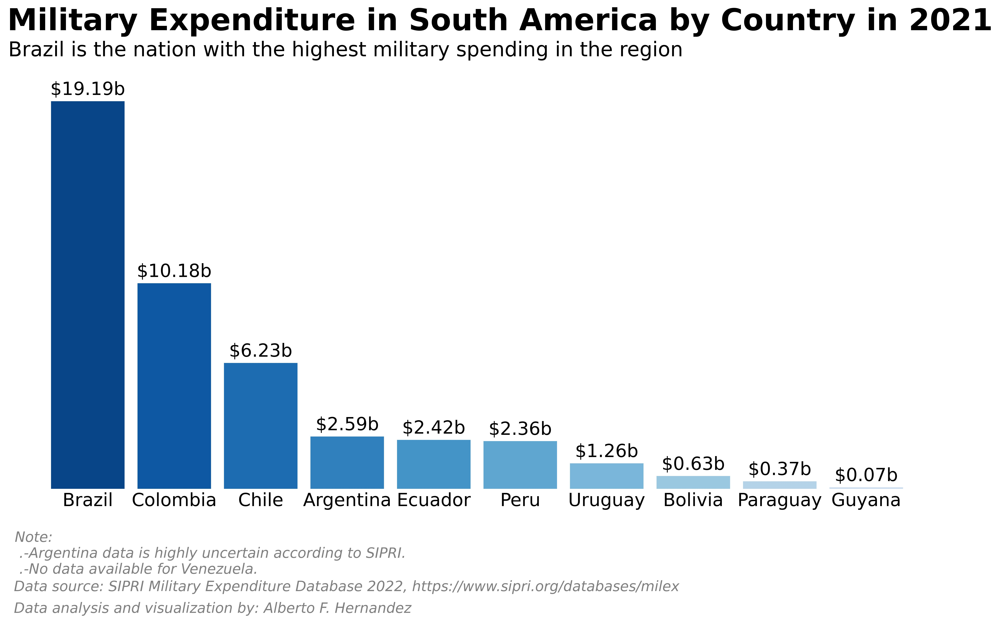

# Military Expenditure Analysis - South American Countries

This Jupyter Notebook contains code to analyze and visualize the military expenditure of South American countries using data from the SIPRI Military Expenditure Database. The notebook processes the raw data, extracts relevant information, and generates two types of bar charts: a simple bar chart for the military expenditure in 2021, and a grouped bar chart comparing the military expenditure in 2020 and 2021.

## Table of Contents

1. [Getting Started](#getting-started)
2. [Notebook Structure](#notebook-structure)
3. [Files in the Project](#files-in-the-project)
4. [Featured Visualization](#featured-visualization)
5. [References](#references)
6. [Contact](#contact)

## Getting Started 

To get started with this Jupyter Notebook, follow these steps:

1. Clone the repository or download the notebook file.
2. Install the required libraries by running `pip install pandas openpyxl matplotlib seaborn`.
3. Open the Jupyter Notebook in JupyterLab, Jupyter Notebook, or your preferred Jupyter environment.
4. Ensure that you have the input data file `SIPRI-Milex-data-2020-2022.xlsx` in the same directory as the notebook.
5. Run the notebook cells in order.

[Back to top](#military-expenditure-analysis---south-american-countries)

## Notebook Structure 

The notebook is organized into sections as follows:

1. **Import Libraries**: Import the necessary Python libraries, such as pandas, matplotlib, seaborn, and warnings.
2. **Data Processing Functions**: Define functions for reading and processing the raw data, extracting relevant data for South American countries, and saving the output to a CSV file.
3. **Data Visualization Functions**: Define functions for generating a bar chart for the military expenditure in 2021 and a grouped bar chart comparing the military expenditure in 2020 and 2021.
4. **Main Execution**: Call the functions to read and process the data, save the output to a CSV file, and generate the bar charts.

[Back to top](#military-expenditure-analysis---south-american-countries)

## Files in the Project 

1. **Jupyter Notebook**: `Military_Expenditure_Analysis.ipynb` - This file contains the main code for the analysis and visualization of the military expenditure data. It includes data processing and visualization functions.
2. **Input Data**: `SIPRI-Milex-data-2020-2022.xlsx` - This file contains the raw military expenditure data from the SIPRI Military Expenditure Database. The data is organized in an Excel sheet named "Current US$".
3. **Output Data**: `Military_Expenditure_By_SA_Countries.csv` - This CSV file is generated by the notebook and contains the processed data for South American countries, including their military expenditure in 2020 and 2021, and their ranking based on the expenditure in 2021.
4. **Image File**: `military_spending_v7.png` - This image file shows the Military Expenditure by South American countries using advanced data storytelling techniques.
5. **README**: `README.md` - This file provides an overview of the project, instructions for getting started, and information about the files in the project.

[Back to top](#military-expenditure-analysis---south-american-countries)

## Featured Visualization 

This chart is a visual representation of the Military Expenditure by South American countries using advanced data storytelling techniques. It provides insights into the differences in military spending among the countries in the region.

[Back to top](#military-expenditure-analysis---south-american-countries)

## References 

1. Stockholm International Peace Research Institute (SIPRI). (2022). SIPRI Military Expenditure Database. Retrieved from https://www.sipri.org/databases/milex

[Back to top](#military-expenditure-analysis---south-american-countries)

## Contact 

For any inquiries or questions about this project, feel free to reach out to:

- Email: [ah8664383@gmail.com](ah8664383@gmail.com)
- LinkedIn: [https://www.linkedin.com/in/albertoscode/](https://www.linkedin.com/in/albertoscode/)

[Back to top](#military-expenditure-analysis---south-american-countries)
